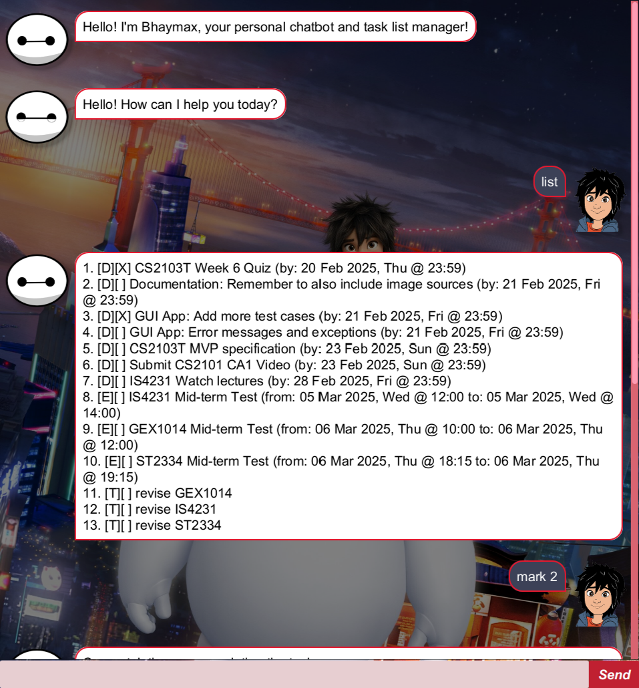

# Bhaymax User Guide

Bhaymax is a chatbot app that is designed to manage tasks {i.e., to-do items, deadlines and events}.

- [Usage](#usage)
- [Features](#features)
  - [Greet Chatbot](#greeting-the-chatbot-optional)
  - [Add To-Do items](#adding-to-do-items-todo)
  - [Add Deadlines](#adding-deadline-deadline)
  - [Add Events](#adding-events-event)
  - [List Tasks and Events](#listing-all-tasks-and-events-list)
  - [Filter by Date (with/without time)](#filtering-deadlines-and-events-by-date-filter)
  - [Search using keyword or keyprase](#search-for-tasks-with-description-matching-keywords-search)
  - [Mark Task as Complete](#marking-a-task-as-completed-mark)
  - [Mark Task as Incomplete](#marking-a-task-as-_incomplete_-unmark)
  - [Delete Task](#deleting-a-task-delete)
  - [Clear Chat](#clear-the-chat-area-clear)
  - [Exit Chat(bot)](#exiting-the-program-bye-or-exit)
  - [Editing the data file](#editing-the-data-file)

## Usage

1. Make sure _Java 17_ is installed in your computer.
2. Bhaymax is available as a Java Archive (`.jar`) file. You can download the latest version from this [URL](https://github.com/HarishB99/ip/releases).
3. Copy the `.jar` file (downloaded in step 2.) to the folder you want to use as the _home folder_ for the application.
4. Open a terminal and change your working directory to the folder selected in step 3.
5. Execute the app by running `java -jar bhaymax.java`
6. You should see a window similar to the one shown [above](#bhaymax-user-guide).

## Features

### Greeting the chatbot (Optional)

Greets the chatbot. (And the chatbot greets you back!)

Format: `hello` __or__ `hi`

### Adding To-Do Items: `todo`

Adds a to-do item to be tracked.

Format: `todo {description}`

Explanation of parameters:
- `{description}`: (Compulsory) A brief description about the
  to-do item to be created.

Examples:
- `todo get notes from friend`
- `todo buy groceries for mother`
- `todo study`

### Adding Deadlines: `deadline`

Adds a deadline item to be tracked.

Format: `deadline {description} /by {due-by date}`

Explanation of parameters:
- `{description}`: (Compulsory) A brief description about the
  deadline item to be created.
- `{due-by date}`: (Compulsory) The date and time at which the 
  deadline is due by, in the format `dd/MM/yyyy HH:mm`
- Order of the parameters must be followed strictly (i.e.,
  `{description}` after `deadline`, `{description}` and `{due-by
  date}` separated by ` /by `)

Examples:
- You need to submit a report by 20 March 2025, 11:59 pm
    - `deadline submit report /by 20/03/2025 23:59`
- You are required to finish your essay by 05 January 2026,
  1:00pm
    - `deadline finish essay /by 05/01/2025 13:00`

### Adding Events: `event`

Adds an event to be tracked.

Format: `event {description} /from {start date} /to {end date}`

Explanation of parameters:
- `{description}`: (Compulsory) A brief description about the
  event to be created.
- `{start date}`: (Compulsory) The date and time at which the 
  event starts, in the format `dd/MM/yyyy HH:mm`
- `{end date}`: (Compulsory) The date and time at which the 
  event end, in the format `dd/MM/yyyy HH:mm`
- Order of the parameters must be followed strictly (i.e.,
  `{description}` after `event`, `{description}` and `{start date}` 
  separated by ` /from `, etc.)

Examples:
- You have a mid-terms on 5 March 2025 from 12pm to 2pm
    - `event mid-terms /from 05/03/2025 12:00 /to 05/03/2025
      14:00`
- There is a movie screening on 22 February 2025 from 1pm to
  3pm
    - `event movie screening /from 22/02/2025 13:00 /to
      22/02/2025 15:00`

### Listing all tasks and events: `list`

Shows a list of all to-do items, deadlines and events created.

Format: `list`

### Filtering deadlines and events by date: `filter`

Filters deadlines and events by date.

Format: `search {filter_option} {date / date and time}`

Explanation of parameters:
- `{filter_option}`: One of 6 values - `/before`, `/on`,
  `/after`, `/before_time`, `/on_time`, `/after_time`
    - Each option specifies whether to list deadlines and events
    occurring before, on or after the date specified
    - Suffix an option with `_time` if you also wish to
      specify the time to filter by
- `{date / date and time}`: The date or the date and time to
  filter by, in the format `dd/MM/yyyy` and `dd/MM/yyyy HH:mm`
  respectively
    - If the `{filter_option}` provided contains the suffix
      `_time`, then a time is also required for the filter
- Order of the parameters must be followed strictly.

Examples:
- To filter for deadline and events due by / occurring ___BEFORE___ March 2nd, 2025:
    - `filter /before 02/03/2025`
- To filter for deadline and events due by / occurring ___ON___ March 2nd, 2025:
    - `filter /on 02/03/2025`
- To filter for deadline and events due by / occurring ___AFTER___ March 2nd, 2025:
    - `filter /after 02/03/2025`
- To filter for deadline and events due by / occurring ___BEFORE___ March 2nd, 2025, 11:59pm:
    - `filter /before_time 02/03/2025 23:59`
- To filter for deadline and events due by / occurring ___ON___ March 2nd, 2025, 11:59pm:
    - `filter /on_time 02/03/2025`
- To filter for deadline and events due by / occurring ___AFTER___ March 2nd, 2025, 11:59pm:
    - `filter /after_time 02/03/2025 23:59`
> Note that for the last three examples the `{filter_option}` is suffixed with `_time` as we are specifying the time (alongside the
> date) to filter the tasks by.

### Search for tasks with description matching keywords: `search`

Searches for a task that has a description matching the provided
search term.

Format: `search {keyword or phrase}`

Explanation of parameters:
- `{keyword or phrase}`: (Compulsory) A keyword or a phrase to
  search for

Examples:
- `search exam`
- `search buy`
- `search movie`

### Marking a task as completed: `mark`

Marks a task (i.e., a to-do item, deadline or event) as
completed.

Format: `mark {index of task}`

Explanation of parameters:
- `{index of task}`: (Compulsory) The index number of the task to be 
  marked as completed. This number can be retrieved using the output 
  of `list`.

Examples:
- `mark 11`
- `mark 1`
- `mark 23`

### Marking a task as _incomplete_: `unmark`

Marks a task (i.e., a to-do item, deadline or event) as
incomplete.

Format: `unmark {index of task}`

Explanation of parameters:
- `{index of task}`: (Compulsory) The index number of the task to be 
  marked as incomplete. This number can be retrieved using the output
  of `list`.

Examples:
- `unmark 11`
- `unmark 1`
- `unmark 23`

### Deleting a task: `delete`

Removes a task (i.e., a to-do item, deadline or event) from
getting tracked.

Format: `delete {index of task}`

Explanation of parameters:
- `{index of task}`: (Compulsory) The index number of the task to be
  deleted. This number can be retrieved using the output
  of `list`.

Examples:
- `delete 11`
- `delete 1`
- `delete 23`

### Clear the chat area: `clear`

Clears the chat (box) area.

Format: `clear`

### Exiting the program: `bye` or `exit`

Exits the program.

Format: `bye` __or__ `exit`

### Editing the data file

The data file is automatically created when a task is added to the program.
It is saved at `[JAR file location]/data/tasks.txt`.
Tasks are stored in the following format:

- To-do item:
    - Format: `T | {task completion status} | {task description}`
    - `{task completion status}`: Indicates whether the task has 
    been marked as completed. It can take one of two values:
        - `1` - Indicates the task has been marked as completed
        - `0` - Indicates the task has been marked as incomplete
    - `{task description}`: A brief description about the
      to-do item.
- Deadline item:
    - Format: `D | {task completion status} | {task description} | {due-by date}`
    - `{task completion status}`: Indicates whether the task has 
    been marked as completed. It can take one of two values:
        - `1` - Indicates the task has been marked as completed
        - `0` - Indicates the task has been marked as incomplete
    - `{task description}`: A brief description about the
      deadline.
    - `{due-by date}`: The date and time the deadline item is due 
    by. Specified in the format `dd/MM/yyyy HH:mm`.
- Event:
    - Format: `E | {task completion status} | {task description} | {start date} | {end date}`
    - `{task completion status}`: Indicates whether the task has 
    been marked as completed. It can take one of two values:
        - `1` - Indicates the task has been marked as completed
        - `0` - Indicates the task has been marked as incomplete
    - `{task description}`: A brief description about the
      event.
    - `{start date}`: The date and time at which the event starts, in the format `dd/MM/yyyy HH:mm`.
    - `{end date}`: The date and time at which the event ends, in the format `dd/MM/yyyy HH:mm`.
